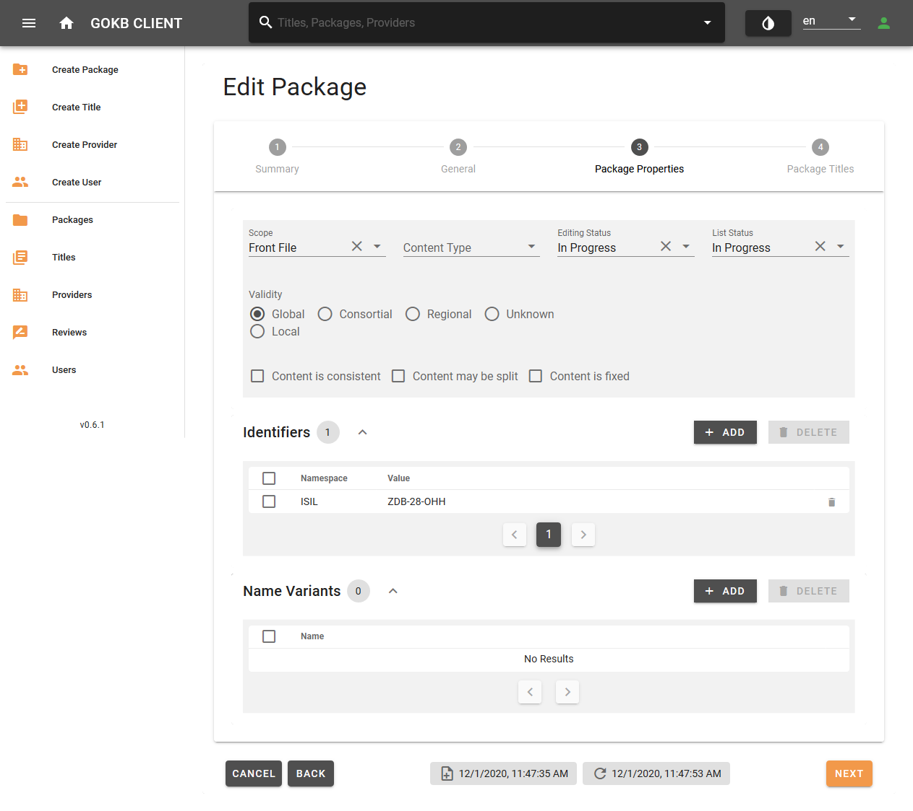

# Create and edit packages

## Get and check KBART files

Package and title data are imported into GOKb from KBART files.

KBART is a NISO standard for representing titles in a package of e-resources. A corresponding example KBART file, which also contains GOKb-relevant extensions of the standard as well as explanations of the individual KBART fields, can be found here: [KBART Introduction](./kbart-introduction.md)

### 1. Validation of the KBART file

KBART files must comply with the KBART standard:

+ The field names and contents must comply with the KBART standard or the enhanced GOkb format. A list of all fields can be found [here](./kbart-introduction.md).
    * All column headers must exist - even if a column has no values.
    * The character encoding must be UTF-8.
    * Tab as separator.
    * Preferably alphabetical order of the titles.
    * The file name must correspond to the standard.
+ The file must contain all current titles of the package offered by the provider, i.e.
    + The title scope and content must correspond to the negotiated package.
    + The access URLs for individual titles must be correct. They must also be universally valid URLs, not institution-specific URLs like proxy URLs.
    + Each resources must be tagged with identifiers.
    + For serial publications like journals, the coverage information (years) must be correct. For example, if only volumes from 1996 onward are offered in a package, this must be reflected in the appropriate columns of the KBART list.

### 2. Mandatory fields for serials (e-journals, serials) 

|Element|KBART field|Mandatory/Optional|Notes|
|-------|-----------|------------------|-----|
|Publication title|publication_title|Mandatory||                  
|ZDB identifier|zdb_id|Optional|At least one identifier must be provided|
|Electronic ISSN|online_identifier|Optional|At least one identifier must be provided|
|Print ISSN|print_identifier|Optional|At least one identifier must be provided|
|Proprietary identifier used by the content provider|title_id|Optional||
|Coverage start|date_first_issue_online|Mandatory||                 
||num_first_vol_online|Optional||               
||num_first_issue_online|Optional||      
|Coverage end|date_last_issue_online|Optional||
||num_last_vol_online|Optional||               
||num_last_issue_online|Optional||
|Coverage depth (full text, abstracts)|coverage_depth|Mandatory||
|Title level URL|title_url|Mandatory||                 
|Media type (journal, book, database) |medium|Optional||    

### 3. Mandatory fields for monographs (e-books,audio and video streams)

|Element|KBART field|Mandatory/Optional|Notes|
|-------|-----------|------------------|-----|
|Publication title|publication_title|Mandatory||                  
|Electronic ISBN|online_identifier|Optional*|At least one identifier must be provided|
|Print ISBN|print_identifier|Optional*|At least one identifier must be provided|
|Digital Object Identifier (DOI)|doi_identifier|Optional*|At least one identifier must be provided|
|Proprietary identifier used by the content provider|title_id|Optional*|At least one identifier must be provided|
|Date when monograph was published online|date_monograph_published_online|Mandatory|| 
|Volume number|monograph_volume|Optional||
|Edition number|monograph_edition|Optional|| 
|Series statement for a series title|monograph_parent_collection_title|Optional||  
|Author|first_author|Optional|| 
|Editor|first_editor|Optional||  
|Title level URL|title_url|Mandatory||                 
|Media type (journal, book, database) |medium|Optional||

GOKb supports the enhancement of KBART with some proprietary fields:

+ For serial publications, the ZDBID can be added to field `zdb_id`.
+ Dates when a title is added or removed for a package can be added to `access_start_date` and `access_end_date` fields. These dates are useful for obtaining the historical status of a package at a particular time.
+ For series of monographs the series statement can be added to `monograph_parent_collection_title` field.
+ Use field `medium` for different media type.

### 4. Notes

* Make sure to import generic title lists into GOKb for each package. Special, locally tailored packages (e.g. different access URL via proxy) from these generic packages, should only be used in local ERM systems.
* For journal lists, make sure that each title has either a ZDBID, an e-ISSNs, or at least a corresponding print ISSN.
* All titles, especially from e-book packages, should have an internal, provider specific title ID (`title_id`), as other identifiers such as ISBNs are often ambiguous.

## Searching a package

Use the "Packages" menu item on the left menu bar for the search of packages. You can search or filter curatory groups, names of the packages, provider  identifier and status of the package. Select a package from the result list and you will get a detailed view of the package. If the package is assigned to your curatory group, you can edit it.

## Create a package

The creation and editing of packages is done via web forms.

+ Create a new package via "Create Package".
+ To edit an existing package, search for it via "Packages" and select the package from the result list.

## Step 1: General information

Add some general information for the package like name, provider and platform.

+ Name: The official name of the package under which it is offered according to the provider. If you want to add data to an existing package, enter the exact name of the package in "Search" field. See [guidelines](./guidelines-for-package-names.md) for naming packages.
+ URL: Add the URL of the website of the package provider.
+ Provider: Select the provider of the package here. You can find the provider via a suggestion list if you enter the name or part of the provider name in the text field. See [instructions](./create-and-edit-provider.md) for creating the provider.
+ Platform: Select the platform of the package here. You can find the platform via a suggestion list by entering the name or a part of the platform name or the platform URL into the search fields. See [instructions](./create-and-edit-provider.md) for creating a platform.

Finish this step by selecting the "Next" button.

## Step 2: Package properties

Add information about the package, identifiers, name and variants.

+ Package type: specify the package type
    * Front File: a current package
    * Archive package (Back File): An archived package
    * Aggregator package
    * Master File: A complete list of all resources offered by a provider.
+ Restriction: Define if the package is offered worldwide (Global), regionally (Regional) or is specifically tailored to a consortia (Consortial). If there is a restriction like "Regional" or "Consortial", you can specify this restriction in the text field. Please follow the [guidelines](./guidelines-for-package-names.md) for package titles. Packages tailored for single institutions are not supported in GOKb.
+ Identifiers: Add unique identifiers for the package. Select a "Namespace" for the identifier and enter the corresponding identifier.
    * Internal identifier: If the package has an identifier of the provider itself, please select the namespace of the provider in the drop-down and enter the internal package identifier. This is important for later referencing.
    * ISIL/Package Label: Official product label from the German "[ISIL agency](https://sigel.staatsbibliothek-berlin.de/startseite/)". You may find it at https://sigel.staatsbibliothek-berlin.de/nc/suche/. Please be sure to include the correct vendor package ISIL. The German ISIL Agency also issues ISIL for packages of alliance, national or consortia licenses. You should only add one ISIL referencing the packages.
+ Name variants: Abbreviations or alternative name variants. This is recommended for common and well-known name variants that are not included in the official name. Name variants can be searched.

Finish this step by selecting the "Next" button.

## Step 3: Package titles

Overview of titles within a package.

+ You can search for titles using the search field in header.
+ You can filter titles using the "Status" selection drop-down menu, e.g. only current, retired or deleted titles.

Select a title from the list to get detailed information for it.

### 5. Uploading a KBART file

Uploading package title via KBART files can be very time consuming. Therefore, you will not see the result in real time. After selecting the KBART file or setting the automatic import, finish editing the package. You will be informed about the titles import status via the "Dashboard".

#### 5.1 Manual loading of a KBART file

You can load a KBART file by selecting the "KBART Import" button. A pop-up window opens, please enter:

+ File: Select a KBART file from your hard disk
+ Namespace: Please select the namespace of the identifier, see [instruction](./create-and-edit-packages.md).
+ API for data enrichment: Please select the API for bibliographic data enrichment. You can choose between the [Zeitschriftendatenbank](https://zdb-katalog.de/) (ZDB) and the [Elektronische Zeitschriftenbibliothek](https://ezb.uni-regensburg.de/index.phtml?bibid=SBBPK&colors=7&lang=en) (EZB).
+ Partial update: If you check this box only titles from the new KBART file will be added to the existing package.

#### 5.2 Automatic loading of a KBART file via URL

+ URL: URL of the KBART file. The URL must link directly to the KBART file. If the URL contains dates (e.g., http://example.org/kbart/2020/10/examplepackage_2020-10-01.txt), you must add the path parameter as variables (http://example.org/kbart/{yyyy}/{mm}/examplepackage_{yyyy-mm-dd}.txt):
    * "y" for the digits of the year
    * "m" for the digits of the month number
    * "d" for the digits of the day number
+ Update cycle: The timespan package for updates.

#### Namespace for `title_id` values

KBART allows different identifiers for `title_id` column. Select the corresponding namespace for the KBART file. For updates of the package this is important, please specify the correct namespace.

## Step 4: Summary

Summary of the selected settings. Please add a curatory group.

+ Curatory group: Select your curator group(s), that will be responsible for maintaining the package. Only selected groups will able to edit and update the package.