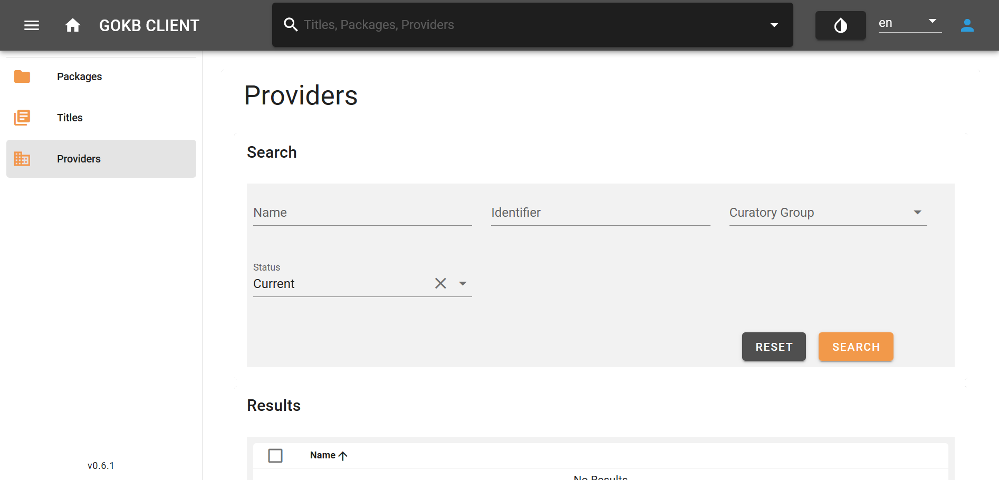
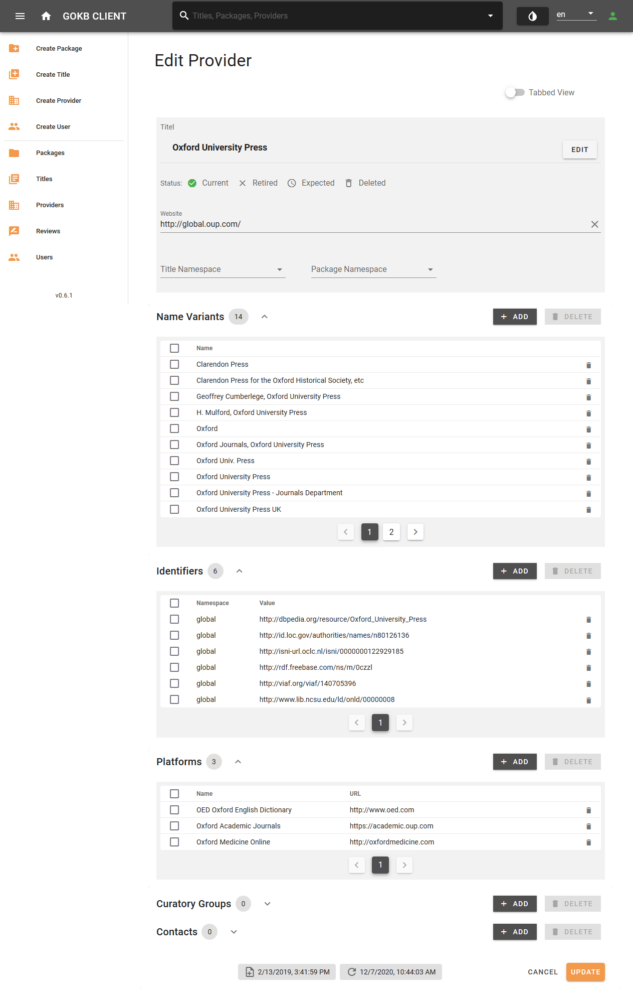

# Create and edit provider

## Search provider

Search for a provider using the "Provider" menu item on the left menu bar. You can search or filter provider by name, identifier or curator group.

## Create and edit provider

You can create and edit provider data via web forms.

### Create provider

Create a provider via the menu item "Create provider". Before creating a new provider, please check if it already exists, to avoid duplicate entries in the database.

[[/images/create-provider.png|GOKB create provider]]

### Edit provider

You can edit providers by searching for a provider (see instructions),  selecting the corresponding provider from the results list and clicking the menu item "Edit".

Enter the following data here:

+ Name: Official name of the provider.
+ Homepage: The general URL to the provider's homepage.
+ Status: Select the status of the provider.

You can add further information about a provider below the main field. These data fields have a uniform usage:

+ If necessary, select the angle icon next to the area name to expand or collapse the area.
+ Select "Add" enter data via a pop-up dialog.
+ Delete several values by selecting the check boxes and then pressing the "Delete" button or selecting the trash icon for single values.

You can add:

+ Name variants: Abbreviations or alternative name forms. Add common and well-known name forms that are not included in the official name form. Name variants can be searched.
+ Identifiers: Identifiers that describe the provider. Select the "Namespace" of the identifier system and enter the identifier value.
+ Platforms: Here you can add the platform or platforms offered by a provider. The platform is defined by:
    * Name: The platform name. If the provider's platform does not have an official name, you can enter the provider's name or the URL itself here.
    * URL: The URL of the platform.
+ Curatory groups: Select your curator group(s), that will be responsible for maintaining the package. Only selected groups will able to edit and update the package.
+ Contacts: Not supported at the moment. 

Once you have added all provider data, select the "Create" or "Update" button at the bottom right.

## What is a platform?

A platform is a provider's software environment for accessing content, such as journals, e-books, or databases. A platform is characterized by:

+ A URL such as http://www.thieme-connect.de (There may be additional subdomains such as http://incites.clarivate.com).
+ An optional name (e.g. SpringerLink). For small providers, offering only one platform, use the provider name.
