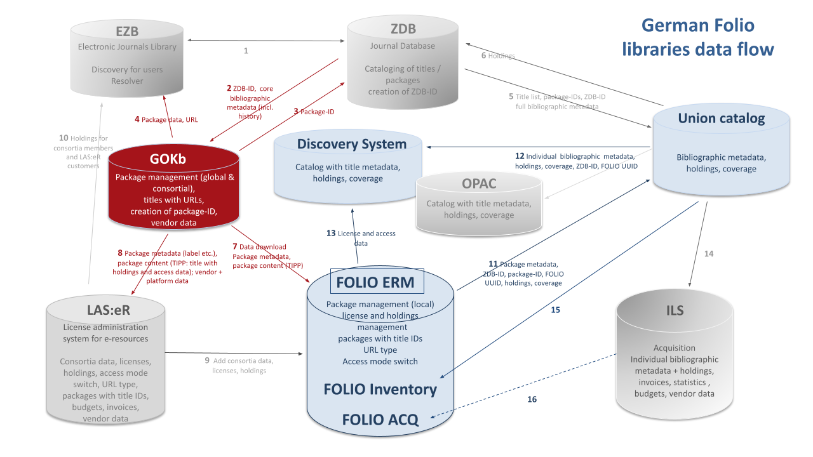

# News

## GOKb & Folio: data flow

*October 6, 2021*

In Germany the GOKb has central role for the management of electronic resource packages. It provides data to national union catalogues like EZB & ZDB, but also to local library systems like Folio:

## Enhanced Import Client

*May 25, 2020*

The enhanced version of the GOKb import client YGOR is now online at
https://gokb.org/ygor. With this version, a detailed view of each
imported record is shown including feedback on erroneous or problematic
data values and the possibility to correct those manually directly in
the GUI. A saving and loading functionality allows stopping and
continuing the upload process at any time. A manual selection of the
content type of the package (serial or monograph) is no longer
necessary, as this information will be interpreted from the
corresponding KBART fields, so an upload of mixed packages is now
possible. A documentation on how to import and enrich KBART data via the
YGOR client can be found in the GOkb wiki:
<https://openlibraryenvironment.atlassian.net/wiki/spaces/GOKB/overview>.

## User interface study & pilot phase

*April 15, 2019*

In 2018 a study for a new user interface for GOKb was funded by the
Bundesministerium für Bildung und Forschung (Federal Ministry of
Education and Research). Results were published in April 2019 and will
be implemented within the next year.

Independently of this development, GOKb began a data ingest pilot phase
incorporating 19 German libraries and consortia. The pilot participants
will ingest KBART packages into GOKb and maintain them there. They will
share their experiences and discuss with the editorial staff at regular
conference calls. The pilot phase is open for all institutions. Please
request a GOKb account https://gokbt.gbv.de/gokb/register, and send an
email to info@gokb.org for further information.

## New import client ‘YGOR’

*January 21, 2019*

The North Rhine-Westphalian Library Service Centre (hbz) developed a new
GOKb import client: YGOR. YGOR is a multilingual web client which
supports the upload of KBART files to GOKb. With its help journal titles
are automatically compared to the title data of the German Union
Catalogue of Serials (ZDB) and enriched with the ZDB-ID, an identifier
that is utilized by all participating information systems in Germany and
Austria, thereby disambiguating the journal titles. The client no longer
relies on OpenRefine but rather uses the cross referencing API of GOKb.
The prototype is hosted at https://gokbt.gbv.de/ygor/. A [GOKb user
account](mailto:info@gokb.org) for the ingest of data is required.

## GOKb Forum

*May 5, 2018*

GOKb, formerly run by North Carolina State University, has reorganised
as a new coalition of partners. GOKb was formed under the Kuali
Foundation as a sister project of Kuali OLE.GOKb is now a community of
the Open Library Foundation (OLF), along with OLE and FOLIO, among
others. At the GOKb Forum event we will introduce new members of the
project team and their respective backgrounds. We will also inform in
detail about the current activities of the GOKb project team (matching
of data against bibliographic databases, new user interface study,
participation in FOLIO ERM Sub Group).

## GOKb Planning Meeting 2017

*July 1, 2017*

The international GOKb partner institutions met in Berlin to discuss the
future orientation and organisation of GOKb. The North Rhine-Westphalian
Library Service Centre (hbz), the Head Office of the GBV (VZG), and the
German Union Catalogue of Serials (ZDB) joined the GOKb steering
committee and formally took over the responsibilities of hosting and
further developing GOKb.

## Invitation to Establish the Open Library Foundation Global Open Knowledgebase

*June 1, 2017*

The Open Library Foundation (OLF) invited the Global Open Knowledgebase
(GOKb) to join its community as a project. For this purpose the GOKb
steering committee will establish a Community Charter that describes the
mission, organisation, and activities of the GOKb community.
